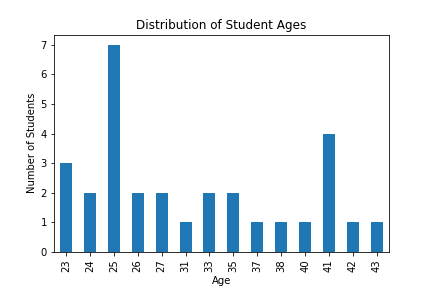
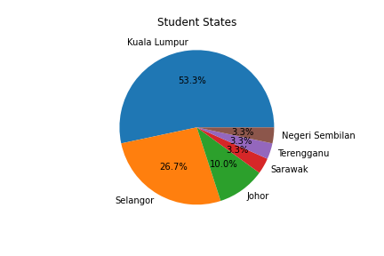
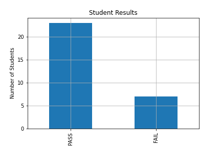
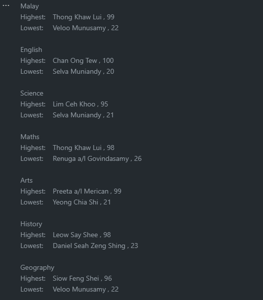
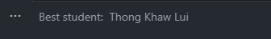
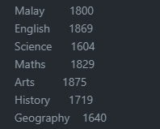
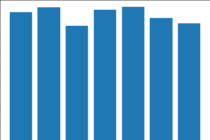
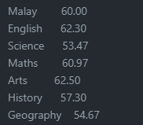
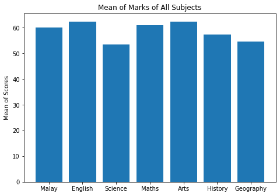

# Mini project for Certified Python Professional by IR Academy (1/3/2022 - 7-3/2022)

The data generated is randomised and might have some discrepencies.

## Findings

### Student age distribution

From the data, this is the distribution of the ages of which the students. It is found that the youngest students are of age 23, while the oldest is of age 43. Students of age 25 compromises of the most number.



### Student origin state

From the data, this is the distribution of the states of which the students resides in. Most of the students live in Kuala Lumpur, while the least are from Negeri Sembilan, Terengganu, and Sarawak respectively.



### Student results

From the data, this is the distribution of the student results. 23 passed and 7 failed.



### Student marks

To get the lowest and the highest marks and the correponding students, this code is used:

```python
for i in index[2:]:
    print(i)

    max = df_marks[i].idxmax()
    max_name = df_marks['Std_Name'][max]
    max_marks = df_marks[i][max]
    
    min = df_marks[i].idxmin()
    min_name = df_marks['Std_Name'][min]
    min_marks = df_marks[i][min]

    print('Highest:\t',max_name, ',', max_marks)
    print('Lowest:\t',min_name, ',', min_marks)
    print()
```

From the data, these are my findings:



### Overall best student

To get the overall best student, this code is used:

```python
top = df['Total'].idxmax()
name = df['Std_Name'][top]

print('Best student: ', name)
```


### Best and worst scoring subjects

From the data, this is the distribution of the sum of marks of all subjects. This is to visualise and analyse which subjects are the students best and worst performing in. Code below is to get the sum of each subject columns

```
sum_of_cols = df_marks_only.sum(axis=0)
print(sum_of_cols)
```


Since the data obtained is fairly small, we could see that Students best perform in Arts and performs worst in Science


#### Graph of Sum of Marks


#### Graph of Mean of Marks

```python
mean_of_cols = df_marks_only.mean(axis=0)

formatted_output = mean_of_cols.apply(lambda x: '{:.2f}'.format(x))
print(formatted_output)
```






