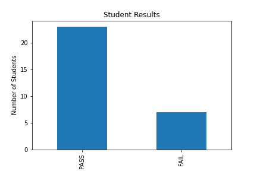

# Mini project for Certified Python Professional by IR Academy (1/3/2022 - 7-3/2022)

The data generated is randomised and might have some discrepencies.

## Findings

### Student age distribution

From the data, this is the distribution of the ages of which the students. It is found that the youngest students are of age 23, while the oldest is of age 43. Students of age 25 compromises of the most number.

### Student origin state

From the data, this is the distribution of the states of which the students resides in. Most of the students live in Kuala Lumpur, while the least are from Negeri Sembilan, Terengganu, snd Sarawak respectively.

### Student results

From the data, this is the distribution of the student results. 23 passed and 7 failed.

